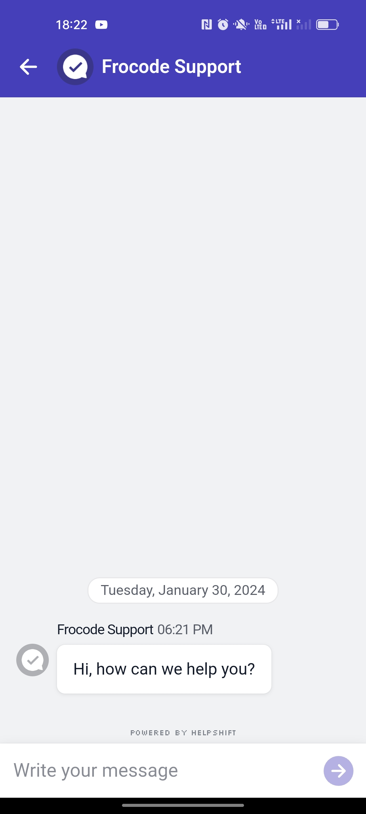
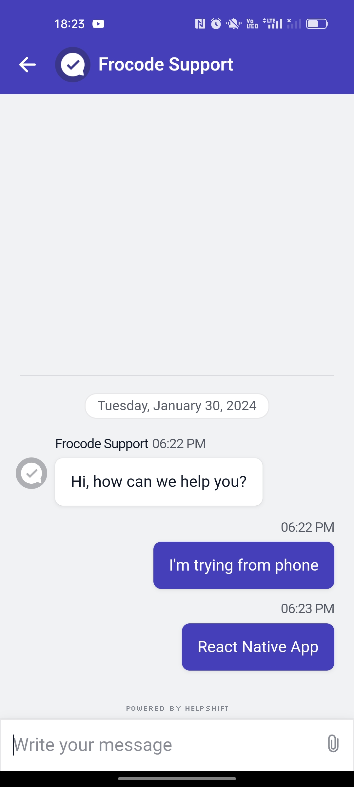

# Helpshift In React Native App

This project integrates Helpshift SDK to provide in-app customer support and chat functionalities.

## Project Description

This application is designed to leverage the capabilities of Helpshift SDK in order to enhance user engagement and support within the app. The key features include:

- In-app chat support: Users can communicate directly with customer support representatives from within the app.
- FAQs and Knowledge Base: Integration of Helpshift's FAQ and knowledge base for easy access to common questions and information.
- Push Notifications: Utilizing Helpshift SDK to send and receive push notifications related to customer support.
- Rich media support: Allows sharing images, videos, and other media within the support chat.

### Prerequisites

- React Native environment setup.
- Android Studio installed for running the app on a simulator or physical device.

##
Results :

